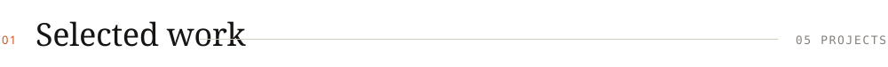
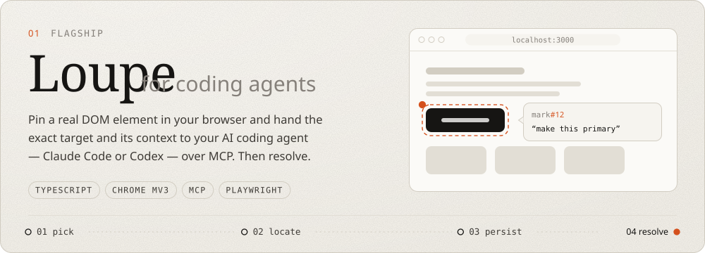
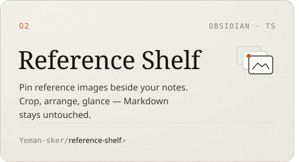
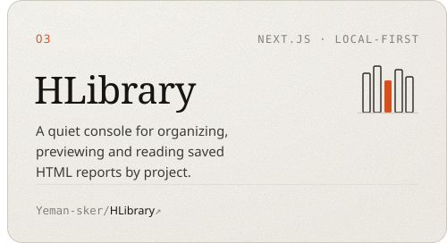
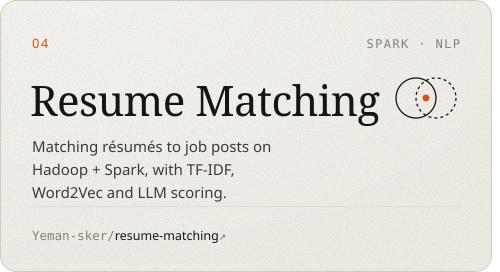
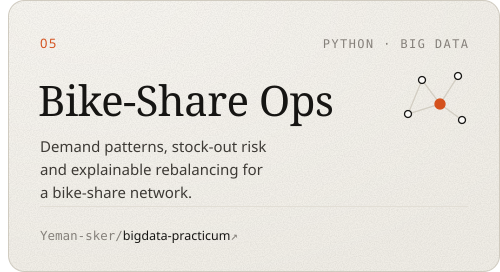
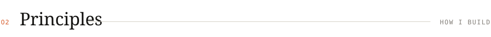
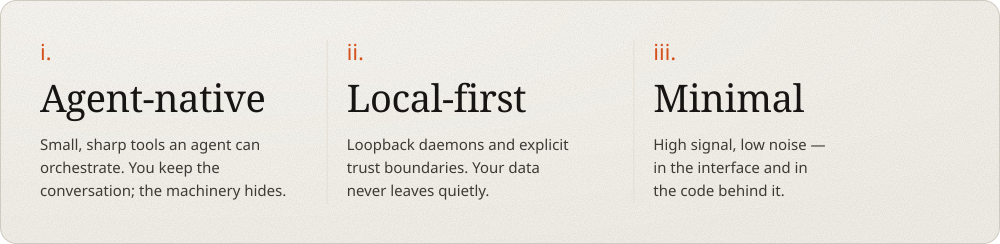
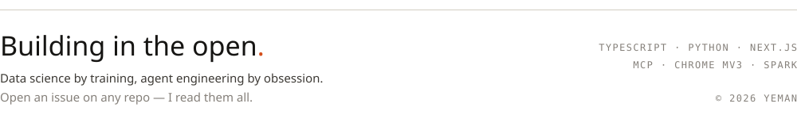

  <a href="https://loupe-landing-umber.vercel.app"><picture><source media="(prefers-color-scheme: dark)" srcset="assets/header-dark.svg"></picture></a>

  <picture><source media="(prefers-color-scheme: dark)" srcset="assets/section-work-dark.svg"></picture>

  <a href="https://github.com/Yeman-sker/Loupe"><picture><source media="(prefers-color-scheme: dark)" srcset="assets/loupe-dark.svg"></picture></a>

  <a href="https://github.com/Yeman-sker/reference-shelf"><picture><source media="(prefers-color-scheme: dark)" srcset="assets/card-reference-shelf-dark.svg"></picture></a><a href="https://github.com/Yeman-sker/HLibrary"><picture><source media="(prefers-color-scheme: dark)" srcset="assets/card-hlibrary-dark.svg"></picture></a>

  <a href="https://github.com/Yeman-sker/resume-matching"><picture><source media="(prefers-color-scheme: dark)" srcset="assets/card-resume-matching-dark.svg"></picture></a><a href="https://github.com/Yeman-sker/bigdata-practicum"><picture><source media="(prefers-color-scheme: dark)" srcset="assets/card-bigdata-practicum-dark.svg"></picture></a>

  <picture><source media="(prefers-color-scheme: dark)" srcset="assets/section-principles-dark.svg"></picture>

  <picture><source media="(prefers-color-scheme: dark)" srcset="assets/principles-dark.svg"></picture>

  <picture><source media="(prefers-color-scheme: dark)" srcset="assets/footer-dark.svg"></picture>

